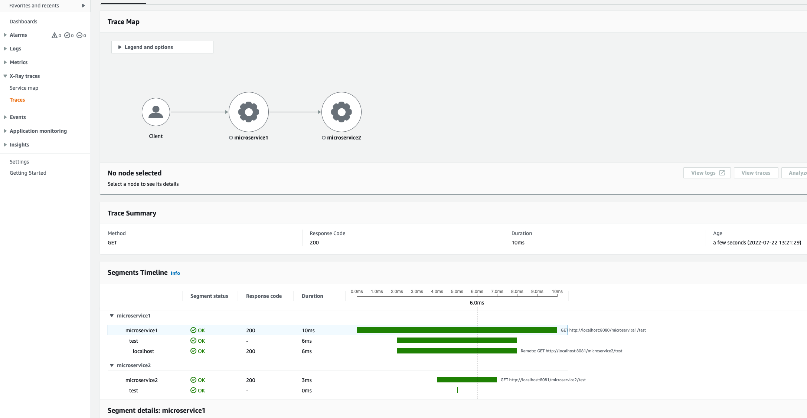

# Setting up Kubernetes

## Setup Ingress (if you don't have already one in your cluster)

```shell
kubectl apply -f https://raw.githubusercontent.com/kubernetes/ingress-nginx/controller-v1.1.1/deploy/static/provider/cloud/deploy.yaml
```

## Modify /etc/host File

Add this to your hosts file :

```shell
127.0.0.1   api.example.com
```

# Run each Microservice locally

```shell
mvn clean spring-boot:run

mvn clean spring-boot:run -Dspring.profiles.active=dev

mvn clean spring-boot:run -Dspring.profiles.active=prod
```

# Test locally

```shell
curl localhost:8080/microservice1/test

curl localhost:8081/microservice2/test
```

# Build Microservice Docker images

```shell
sh build-images.sh
```

# Setup Kubernetes Environment

## Create K8S Secrets file for AWS Auth Keys

Create some content at filename = `kube-xray-daemon/aws-auth-secrets.yaml`

Even though your AWS credentials already look like BASE64 they need to be BASE64'd again for K8S.

A sample file is provided (as `kube-xray-daemon/aws-auth-secrets.yaml.template`) - be sure to
rename it to a yaml file.

Content :

```yaml
apiVersion: v1
data:
  aws_access_key_id: <AWS ACCESS KEY ID HERE AFTER BEING BASE64'd>
  aws_secret_access_key: <AWS SECRET ACCESS KEY HERE AFTER BEING BASE64'd>
kind: Secret
metadata:
  name: aws-secrets
```

## Setup XRay Daemon in Kubernetes

```bash
kubectl apply -f kube-xray-daemon

kubectl apply -f kube
```

### View XRay Daemon logs

```bash
kubectl logs -f $(kc get po | grep "xray-daemon" | awk '{ print $1 }')
```

## Some useful K8S Commands

```bash
kubectl get po
kubectl get svc
kubectl get statefulset

kubectl logs -f microservice1-0
kubectl logs -f microservice2-0

# To delete resources use this
kubectl delete -f kube
kubectl delete -f kube-xray-daemon
```

# Execute in Kubernetes

```shell
curl api.example.com/microservice1/test
curl api.example.com/microservice1/test/hello

curl api.example.com/microservice2/test
curl api.example.com/microservice2/test/hello
```

# Observe the results in XRay Console in AWS Management Console

